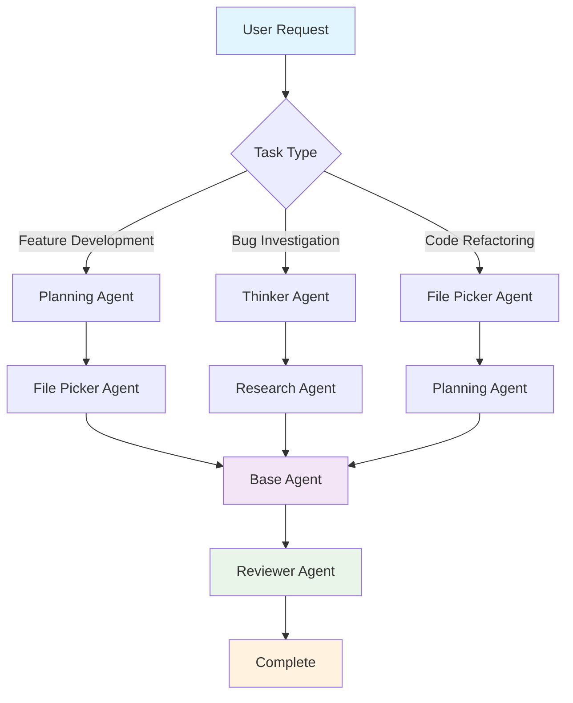

# Overview

## Why Multi-Agent Systems Work Better

Codebuff uses agents that can spawn others, share tools, and pass context between tasks:

- **Code Generation** - Write clean, functional code
- **Review** - Catch bugs, security issues, style violations
- **Research** - Find documentation and examples
- **Planning** - Break down complex requirements
- **File Discovery** - Navigate large codebases

## Programmatic Control

Control agents with TypeScript generator functions. Orchestrate workflows, branch on file contents, and make steps deterministic instead of hoping a prompt lands the right way.

## Built-in Agents

- `codebuff/base` - Main coding assistant (orchestrates other agents)
- `codebuff/editor` - Code editing and file modifications
- `codebuff/reviewer` - Code review and feedback
- `codebuff/thinker` - Deep thinking and problem analysis
- `codebuff/researcher` - Web search and documentation lookup
- `codebuff/file-picker` - File discovery in your codebase
- `codebuff/commander` - Terminal command execution
- `codebuff/code-searcher` - Search patterns in code files

Browse all available agents at the [Agent Store](https://codebuff.com/store).

## Agent Workflow

A typical call to Codebuff may result in the following flow:



### Example: Authentication System Refactoring

If you ask "refactor this authentication system", Codebuff might:

1. **File Picker** finds auth-related files
2. **Research** looks up best practices
3. **Planning** creates step-by-step plan
4. **Base** implements changes informed by the previous agents
5. **Reviewer** checks for security issues

### Agent Coordination

Agents coordinate through the `spawnerPrompt` field, which tells others when to spawn them:

- Specialized agents are spawned for specific tasks
- Each agent clearly describes its purpose and capabilities
- The system automatically matches tasks to the right agents

Agents can spawn others listed in `spawnableAgents`, forming a simple hierarchy.

## Quick Start

import { Card, CardContent, CardHeader, CardTitle } from '@/components/ui/card'

<Card className="not-prose">
  <CardHeader>
    <CardTitle className="flex items-center gap-2 text-lg">
      <span>🚀</span>
      <span>Ready to create your first agent?</span>
    </CardTitle>
  </CardHeader>
  <CardContent>
    <p className="mb-4">Start Codebuff in your project and run:</p>

    ```bash
    codebuff init-agents
    ```

  </CardContent>
</Card>

1. **[Customize existing agents](/docs/agents#customizing-agents)** - Modify prompts and tools
2. **[Create new agents](/docs/agents#creating-new-agents)** - Build specialized functionality
3. **[Reference guide](/docs/agents#agent-reference)** - Complete field documentation
